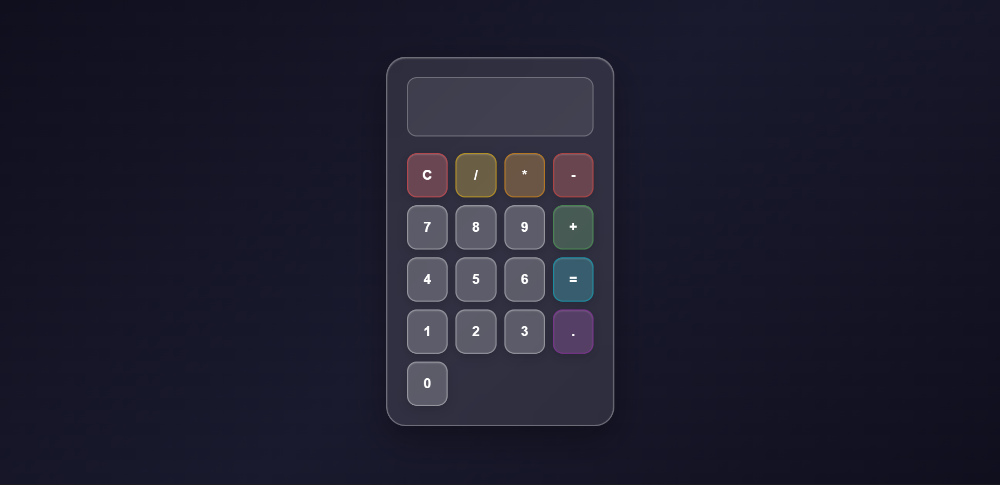

# 🧮 Simple Calculator

A basic and beginner-friendly calculator built using HTML, CSS, and JavaScript. It performs standard arithmetic operations and helps in understanding core JavaScript concepts like event handling and DOM manipulation.

---

## 🚀 Features

* ➕ Addition
* ➖ Subtraction
* ✖️ Multiplication
* ➗ Division
* 🔄 Clear / Reset functionality
* ⚡ Instant result display

---

## 📂 Project Structure

```id="0p9l5a"
Simple-calculator/
│── index.html
│── style.css
│── script.js
```

---

## 🛠️ How It Works

This project uses JavaScript to:

* Capture user input from buttons
* Perform arithmetic operations
* Update the display dynamically

A simple calculator typically handles operations like addition, subtraction, multiplication, and division using JavaScript functions and DOM updates. ([Naukri][1])

---

## ▶️ Getting Started

### 1. Clone the repository

```bash id="m0xg6o"
git clone https://github.com/SwarajThakre/Simple-calculator.git
```

### 2. Run the project

Open `index.html` in your browser.

---

## 💡 Example Code

```javascript
function calculate(num1, num2, operator) {
  switch (operator) {
    case "+":
      return num1 + num2;

    case "-":
      return num1 - num2;

    case "*":
      return num1 * num2;

    case "/":
      return num2 !== 0 ? num1 / num2 : "Error";

    default:
      return "Invalid Operation";
  }
}
```

---

## 🧠 Concepts Used

* DOM Manipulation
* Event Listeners
* Functions
* Conditional Statements
* Basic Arithmetic Logic

---

## 📸 Demo



---

## 📌 Future Improvements

* 🎨 Improve UI design
* 📱 Make it fully responsive
* ⌨️ Add keyboard support
* 📊 Add advanced operations (%, √, etc.)
* 🕘 Add calculation history

---

## 🤝 Contributing

Contributions are welcome!

1. Fork the repository
2. Create a new branch
3. Make your changes
4. Submit a Pull Request

---

## 📄 License

This project is open source and available under the MIT License.

---

### ⭐ If you like this project, consider giving it a star!

[1]: https://www.naukri.com/code360/library/simple-calculator-using-javascript?utm_source=chatgpt.com "Simple Calculator Using JavaScript - Naukri Code 360"
